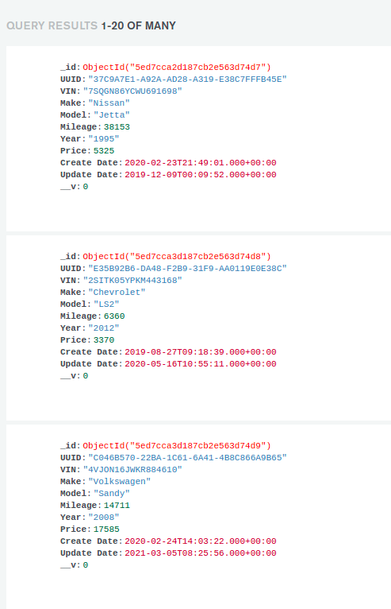

# AutoFi - Coding challenge

This is the code for the solution of the coding challenge. In this proyect I used

- ExpressJS
- Mongoose
- Typescript
- csvToJson

## Asumptions and general decisions

I used the site http://www.generatedata.com/ to generate 3 CSV files with 100 records each with the following scenarios:

1. client1: This client will send a CSV file with a separation delimiter of '|'. The fields sent are the ones we care about and in the order that shows on the requirements.
2. client2: This client will send the file with the same delimiter as Test1 but the fields will not be in the same order.
3. client3: This client will send a CSV file with a separation delimiter of '$'. Also it will not have all 10 fields we care about and also, it will have 2 extra fields we don't care about.

I know CSV files are comma separated values, but I decided to change the default delimiter to be able to configure it to handle any delimiter.

I assumed that the file upload will be saved in a folder called uploads in the root of the proyect.

The CSV files names are:

1. finaldataTest1, which is sent by client1
2. finaldataTest2, which is sent by client2
3. finaldataTest3, which is sent by client3

## Installation

```bash
$ npm install
```

## Running the app

```bash
# development
$ npm run dev

# watch mode
$ npm run debug

# production mode
$ npm run start
```
To access the endpoint you can use cURL like in this example:
```bash
$ curl -d "clientName=client1&csvFilePath=finalDataTest1.csv" -X POST http://localhost:8080/api/v1/cars/processCarInfoFromCSV
```

## Example results

This is an example on how the results look in mongodb Atlas as a result of calling the above example

